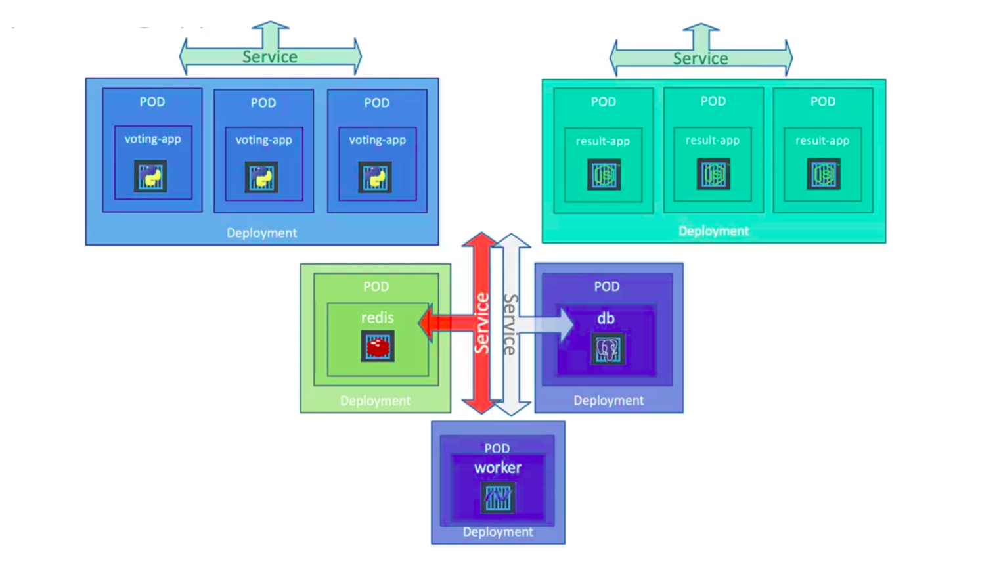
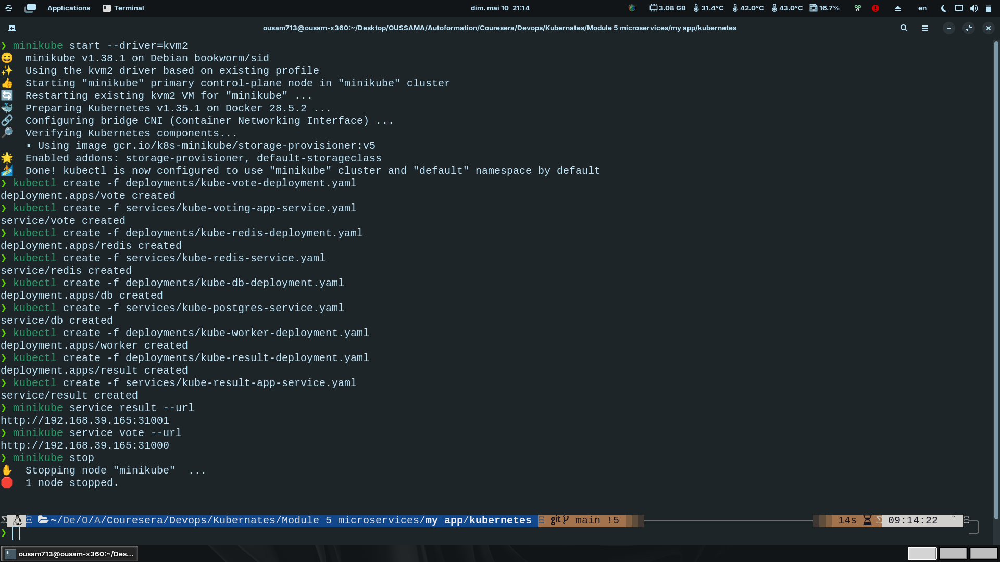
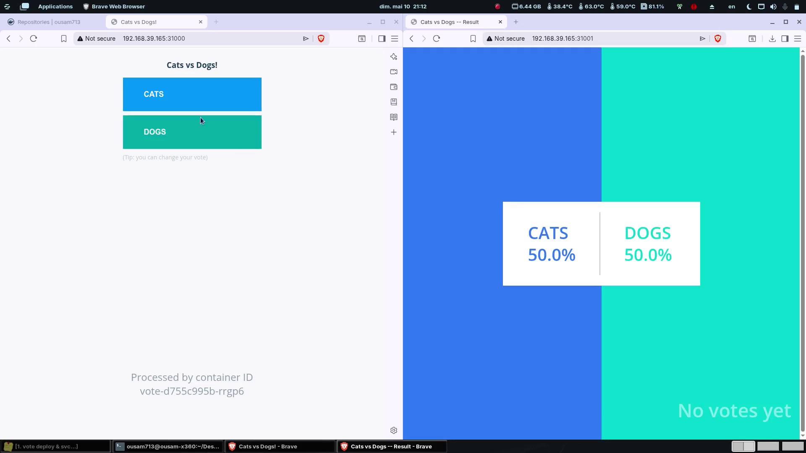

# Microservices Voting Application

A simple microservices-based voting application built to demonstrate Docker and Kubernetes concepts.

## Project Overview

This application allows users to vote between dog lovers and cat lovers.

The project showcases how multiple services written in different technologies can work together inside a containerized environment.

---

## Architecture

The application consists of 5 main components:


| Service | Technology | Purpose |
|---|---|---|
| Vote App | Python | Frontend voting interface |
| Redis | Redis | In-memory data store |
| Worker | .NET | Processes votes |
| PostgreSQL | PostgreSQL | Persistent database |
| Result App | Node.js | Displays voting results |



---

## Application Workflow

1. User submits a vote from the Voting App
2. Vote is stored temporarily in Redis
3. Worker service processes the vote
4. PostgreSQL database is updated
5. Result App displays updated vote counts

---

## Technologies Used

- Docker
- Kubernetes
- Python
- Node.js
- .NET
- Redis
- PostgreSQL
- Minikube

---

# Running the Application with Minikube

## 1. Start Minikube

```bash
minikube start --driver=kvm2
````

---

## 2. Deploy the Application

### Create deployments and services

```bash
kubectl create -f deployments/ -f services/
```

---

## 3. Get Service URLs

```bash
minikube service result --url
minikube service vote --url
```



---

# Kubernetes Resources

This repository contains:

* Deployments
* Services
* Multi-container application setup
* Kubernetes manifests

---

# Learning Objectives

This project helps understand:

* Microservices Architecture
* Docker Containerization
* Kubernetes Deployments & Services
* Service Communication
* Distributed Systems
* Cloud-Native Application Design

---

# Demo



---

